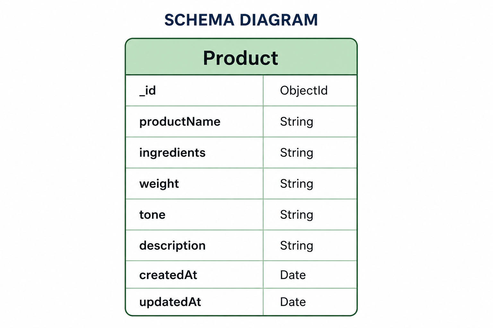

# AI Product Description Generator

A full-stack AI-powered web application that helps Food Processing MSMEs generate professional product descriptions using **Google Gemini AI**. The application provides secure authentication, product management, and AI-powered content generation using a React frontend, Express.js backend, and MongoDB Atlas.

---

# Tech Stack

## Frontend

- React.js
- Vite
- Tailwind CSS
- React Router DOM

## Backend

- Node.js
- Express.js
- MongoDB Atlas
- Mongoose ODM
- JWT Authentication
- Google OAuth 2.0
- Passport.js
- Express Session
- Google Gemini AI (@google/genai)
- CORS
- Dotenv

---

# Features

## Authentication

- User Registration
- User Login
- JWT Authentication
- Google OAuth Login
- Protected Routes
- Secure Password Hashing
- Session Management

## Product Management

- Create Product
- View Products
- Update Product
- Delete Product
- Product Search
- MongoDB Atlas Integration

## AI Features

- AI Product Description Generator
- Google Gemini AI Integration
- Multiple Writing Tones
- Ingredient-Aware Descriptions
- Professional Marketing Copy
- Fast AI Response

---

# Database

## Database Choice

This project uses **MongoDB Atlas** with **Mongoose ODM** for persistent cloud storage.

MongoDB was selected because product information is document-based and benefits from a flexible schema.

---

# Database Schema

## User Collection

| Field | Type |
|--------|------|
| _id | ObjectId |
| name | String |
| email | String |
| password | String |
| googleId | String |
| createdAt | Date |

---

## Product Collection

| Field | Type |
|--------|------|
| _id | ObjectId |
| productName | String |
| ingredients | String |
| weight | String |
| tone | String |
| description | String |
| createdAt | Date |
| updatedAt | Date |

---

# Schema Diagram



---

# Project Structure

```text
ai-product-description-generator/
│
├── frontend/
│   ├── src/
│   │   ├── components/
│   │   ├── pages/
│   │   ├── routes/
│   │   └── App.jsx
│
├── backend/
│   ├── config/
│   ├── controllers/
│   ├── middleware/
│   ├── models/
│   │   ├── Product.js
│   │   └── User.js
│   ├── routes/
│   ├── .env.example
│   ├── package.json
│   └── server.js
│
├── README.md
├── PROMPTS.md
└── W5_SchemaDiagram_26100903.png
```

---

# Installation

## Clone Repository

```bash
git clone https://github.com/yourusername/ai-product-description-generator.git
```

---

## Backend

```bash
cd backend
npm install
npm run dev
```

Backend runs at

```
http://localhost:5000
```

---

## Frontend

```bash
cd frontend
npm install
npm run dev
```

Frontend runs at

```
http://localhost:5173
```

---

# Environment Variables

Create a `.env` file inside the backend folder.

```env
PORT=5000

MONGO_URI=your_mongodb_connection_string

JWT_SECRET=your_secret_key

SESSION_SECRET=your_session_secret

GOOGLE_CLIENT_ID=your_google_client_id

GOOGLE_CLIENT_SECRET=your_google_client_secret

GEMINI_API_KEY=your_gemini_api_key
```

---

# API Endpoints

## Authentication

| Method | Endpoint | Description |
|--------|----------|-------------|
| POST | /api/auth/register | Register User |
| POST | /api/auth/login | Login User |
| GET | /api/auth/google | Google Login |
| GET | /api/auth/logout | Logout |

---

## Products

| Method | Endpoint | Description |
|--------|----------|-------------|
| GET | /api/products | Get All Products |
| POST | /api/products | Create Product |
| PUT | /api/products/:id | Update Product |
| DELETE | /api/products/:id | Delete Product |
| GET | /api/products/search?q=keyword | Search Products |

---

## AI

| Method | Endpoint | Description |
|--------|----------|-------------|
| POST | /api/ai/generate | Generate AI Product Description |

---

# AI Request

```json
{
  "productName": "Organic Mango Pickle",
  "ingredients": "Raw Mango, Salt, Mustard Oil",
  "weight": "500g",
  "tone": "Premium"
}
```

---

# AI Response

```json
{
  "success": true,
  "description": "AI generated product description..."
}
```

---

# Project Highlights

- JWT Authentication
- Google OAuth Login
- Protected Routes
- MongoDB Atlas Database
- Full CRUD Operations
- Product Search
- Google Gemini AI Integration
- AI Generated Product Descriptions
- Responsive UI
- RESTful APIs
- API Testing with Postman

---

# Future Improvements

- Image Upload
- AI Image Generation
- Multi-language Product Descriptions
- Admin Dashboard
- Product Analytics
- Export Description as PDF

---

# Author

**Arnav Singh**

B.Tech CSE (AI & DS)

Graphic Era Deemed to be University